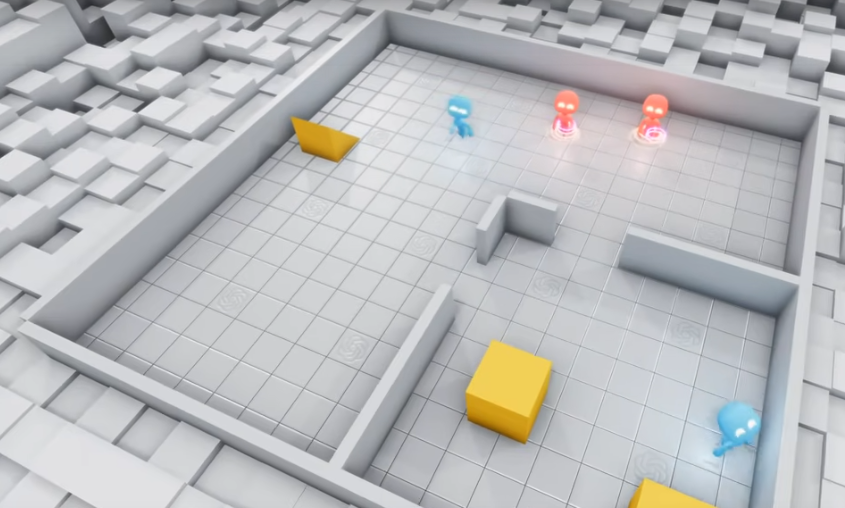

<h1><strong>Dev diary for the production of my COMP250 artefact</strong></h1>

By James Absolom

<h2><strong>Introduction</strong></h2>

This is a diary of my development process for my COMP250 artefact. I will be using this diary to keep track of my progress and to reflect on my development process. This diary will be split into eras, each of which will be a separate section. The eras will be split by major changes in the creation of the project, such as the addition of a new feature or the completion of a major milestone.

For each era, I will include a description of the changes made, a reflection on the development process, and a list of the changes made. I will also include a list of the changes made in each era in the table of contents. To also keep the citations section short all citations will be done in the era they are mentioned; this does mean that some citations may be repeated.

My artefact will be a multi agent system which will be used to simulate and prevent the spread of disease through a population. The system will be comprised of two components a neural network and a genetic algorithm. To make my life easier and to prevent over scoping I intend to not build my own neural network and instead intend to use a prebuilt library. My main contribution will be the devlopment of the genetic algorithm.

The link to this project is here: <a href="https://github.falmouth.ac.uk/JA244121/Comp250-JA244121">Project github</a>
(Though its very possible you are already on this page)

<h2><strong>Table of contents</strong></h2>
<ol>
<li><a href="#Proposal">Proposal</a></li>
	<ol>
    <li><a href="#ProposalOutline">Outline of artefact</a></li>
	<li><a href="#ProposalArchitecture">UML Diagram / System architecture</a></li>
	<li><a href="#ProposalGantt">Gantt Chart</a></li>
    </ol>
<li><a href="#Era1">Era1: Deciding which AI to use (Research)</a></li>
    <ol>
    <li><a href="#Era1Changes">Changes</a></li>
    <li><a href="#Era1Intro">Introduction</a></li>
    <li><a href="#Era1Stage1">PyGame Learning Environment</a></li>
    <li><a href="#Era1Stage2">Lupoglaz Godot AI Gym</a></li>
    <li><a href="#Era1Stage3">NAD LABS youtube video</a></li>
    <li><a href="#Era1Stage4">Mohsen Zare GDNative neural net library</a></li>
    <li><a href="#Era1Stage5">Andrea Catania's custom Godot Distribution</a></li>
    </ol>
<li><a href="#Era2">Era2: Developing the environment and spawning agents (practical)</a></li>
    <ol>
    <li><a href="#Era2Changes">Changes</a></li>
    <li><a href="#Era2Intro">Introduction</a></li>
    <li><a href="#Era2Stage1">Creating the godot object</a></li>
    <li><a href="#Era2Stage2">Instantiating the objects in the main scene</a></li>
    <li><a href="#Era2Stage3">Developing the environment (food, water and walls)</a></li>
    <li><a href="#Era2Stage4">Implementing Infection systems and spawning infector</a></li>
    <li><a href="#Era2Stage5">Moving variable storage to globals</a></li>
	<li><a href="#Era2Stage6">Getting other agent distances and optimising</a></li>
    </ol>
<li><a href="#Era3">Era3: Changing AI methodology ... Again (Research)</a></li>
    <ol>
    <li><a href="#Era3Changes">Changes</a></li>
    <li><a href="#Era3Intro">Introduction</a></li>
	<li><a href="#Era3Stage1">What is NEAT?</a></li>
	</ol>
</ol>

<h2 id="Proposal"><strong>Proposal</strong></h2>

<h3 id="ProposalOutline"><strong>Outline of artefact</strong></h3>

Recent human events (The spread of Covid-19) have proven the effect the spread of a disease can have on:
<ul>
<li>The healthcare system [1]</li>
<li>Mental health [2]</li>
<li>The economy [3]</li>
<li>Globalisation [4]</li>
</ul>

This means it's important to come up with new ideas for keeping populations safe from disease. One way of doing this is to use mathematical models to simulate the spread of disease. This was done in the UK with the "Track and Trace" [5] system, which used mathematical models to predict the spread of the disease. This information was then used by the government to make an informed decision on actions to slow the spread of COVID-19.

The proposed system will use a "Deep Reinforcement Learning"(DRL) model to provide novel solutions and strategies for preventing the spread of infectious diseases. In the past DRL has proven its ability to develop emergent behaviour, one example of this is OpenAI's hide-and-seek project [7].



<i> Fig 1 - OpenAI's hide-and-seek project </i>

In this project, Bowen et al. developed two agents tasked with playing the game hide-and-seek. These agents came up with many unique ideas (such as box surfing and using ramps) which Bowen did not programmatically incentivise. This system will aim to analyse emergent behaviour given the disease spread context. This would be done by simulating many different DRL agents who all want to avoid the disease for as long as possible while also keeping their other needs, for example; food and water met.

<h3 id="ProposalArchitecture"><strong>UML Diagram / System architecture</strong></h3>

 

<i> Fig 2 - UML diagram for the proposed system </i>

This proposed system would use reinforcement learning which will be built using PyGame Learning Environment (PLE) [6], where the agents will be rewarded for surviving but punished for dying by any means e.g food, water or infection. This would allow the agents to build a neural net allowing them to learn how to avoid the disease. The use of PLE will also allow us to visualize the system to see how the agents are behaving.

The system will be trained in rounds lasting an amount of time set by the user. Each round will start with an infection starter pawn being put into the system. This pawn will not be advanced and will just pick a random direction and move in it and change direction every few seconds.

To accurately simulate real-life scenarios the disease will have an incubation time (r-value) which will be default set to 1.1 (between 1.0 and 1.2) as that is the r-value of Covid-19 [8] however this value can be changed by the user for other simulations. While the incubation time is active the infected will be able to infect others but will not be visibly infected. To also simulate real-life scenarios the agents will only be able to tell if someone is infected past the incubation time as it is common to be asymptomatic during the incubation period. Once an agent is infected it will continue its daily routine but will be able to infect others. The other parallel to real life is that the agents will have to consume food and water which they will have to collect from central points, this is designed to simulate the supermarkets and gathering points we have in real life.

There will be several variables in the system which will determine both agent actions and the spread of the disease. These inputs will be:
<ul>
<li> Variables to control disease spread (most can be enabled/disabled by the user):
<ul>
<li> Rest period (how long after getting the disease before you can spread it)</li>
<li> Incubation time (how long before you show symptoms)</li>
<li> Transmission distance (distance at which you're susceptible to infection)</li>
<li> Transmission rate (how long it takes to get the disease) </li>
</ul>
</li>
<li> Variables to control agent actions (most can be enabled/disabled by the user):
<ul>
<li> Speed (how fast the agent moves) </li>
<li> Is there another agent in the vision range </li>
<li> The direction of the agent in vision range </li>
<li> The distance to the agent in vision range </li>
<li> Is the agent in vision visibly infected </li>
<li> Location of food supply </li>
<li> Location of water supply </li>
<li> How many infected people there are </li>
<li> Current agent position </li>
<li> Current agent hunger </li>
<li> Current agent thirst </li>
</ul>
</li>
</ul>

There is currently only one action the agents can take which will be:
<ul>
<li> Move in a direction (x, y) </li>
</ul>

<h3><strong id="ProposalGantt">Gantt Chart</strong></h3>

 

<i> Fig 3 - Gantt chart diagram for developing proposed system </i>

<h3><strong>Citations</strong></h3>

<ol>
<li> Mehlmann-Wicks, J. (2022) Covid-19: Impact of the pandemic on healthcare delivery, The British Medical Association is the trade union and professional body for doctors in the UK. British Medical Association. Available at: https://www.bma.org.uk/advice-and-support/covid-19/what-the-bma-is-doing/covid-19-impact-of-the-pandemic-on-healthcare-delivery (Accessed: February 2, 2023). </li>
<li> Daly, M., Sutin, A. and Robinson, E. (2020) “Longitudinal changes in mental health and the COVID-19 pandemic: Evidence from the UK household longitudinal study.” Available at: https://doi.org/10.31234/osf.io/qd5z7. </li>
<li> Lombardelli, C. (2022) Covid and the UK economy - speech by Clare Lombardelli, chief economic advisor, HM Treasury, GOV.UK. Available at: https://www.gov.uk/government/speeches/covid-and-the-uk-economy-speech-by-clare-lombardelli-chief-economic-advisor-hm-treasury (Accessed: February 2, 2023). </li>
<li> Shrestha, N. et al. (2020) “The impact of covid-19 on Globalization,” One Health, 11, p. 100180. Available at: https://doi.org/10.1016/j.onehlt.2020.100180. </li>
<li> He, B. et al. (2021) “Effectiveness and resource requirements of test, Trace and isolate strategies for Covid in the UK,” Royal Society Open Science, 8(3). Available at: https://doi.org/10.1098/rsos.201491. </li>
<li> PLE: A reinforcement learning environment¶ (2016) PLE: A Reinforcement Learning Environment - PyGame Learning Environment 0.1.dev1 documentation. Available at: https://pygame-learning-environment.readthedocs.io/en/latest/ (Accessed: February 2, 2023). </li>
<li>Baker, B., Kanitscheider, I., Markov, T., Wu, Y., Powell, G., McGrew, B. and Mordatch, I., 2019. Emergent tool use from multi-agent autocurricula. arXiv preprint arXiv:1909.07528.</li>
<li> UK Health Security Agency (2020) The R value and growth rate, GOV.UK. Available at: https://www.gov.uk/guidance/the-r-value-and-growth-rate (Accessed: February 3, 2023).</li>
</ol>

<h2 id="Era1"><strong>Era 1: Deciding which AI to use (Research)</strong></h2>

<h3 id="Era1Changes"><strong>Changes made</strong></h3>
<ul>
<li>Decided which AI to use for the project</li>
</ul>

<h3 id="Era1Intro"><strong>Introduction to era</strong></h3>
The main goal of this era was to decide which AI to use for the project. There are a few requirements I had for the AI, these were:
<ul>
<li>It must be able to be used in a 2D top down environment, as I dont want to make a whole 3d environment</li>
<li>It must be python based, as I am most familiar with python</li>
<li>Preferably it should be able to be used in godot or pygame as I want a visualisation of the agents</li>
</ul>

<h3 id="Era1Stage1"><strong>1: PyGame Learning Environment (PLE)</strong></h3>

My first choice was PLE [1] as it fufilled all of my requirements; PLE is a python library which add reinforcement learning to pygame. It has a number of game examples, for instance flappy bird which really helped in my research as I could see how it worked. However once I looked into developing my own AI's in PLE it became obvious that this was not the AI for me; the primary reason for this is that PLE didn't seem to have alot of documentation that wasn't about their prebuilt games. This meant that I would have to spend alot of time trying to figure out how to use the library, which would take away from the time I could spend on the project. I also found that the library was not very well maintained, with the last commit being in 2016 [2]. This meant that if I had any issues with the library I would have to fix them myself, which would take away from the time I could spend on the project.

<h3 id="Era1Stage2"><strong>2: Lupoglaz Godot AI Gym</strong></h3>

Next I looked into Lupoglaz's Godot AI Gym [3]. This was a library which used Godot and Python to create a reinforcement learning AI.

This AI environment showed alot of promise as it worked really well in the examples and I managed to get it up and running in a day or two. However I found out that there was basically no documentation for the library. There some examples which I watched working and I tried to read through them and understand them however they were not commented and thus I found it impossible to understand what everything did.

The other intersting thing about this library was that it was using very old versions of Godot and Python aswell as outdated libraries. This meant that looking for any information around using the library was difficult as most of the information I needed was outdated. This also meant that the setup process for the library was very difficult as I had to find the correct versions of everything and then get them to work correctly. I refined this into a nice setup instruction file which is something I intend to keep for the final project.

However looking into this library did help me learn a very important fact; the previous two AI's I had looked at were both reinfocement learning AI's. This meant they worked well if one agent was on the screen however what I want is a multi agent system. So after some research I found out what I really needed was a genetic algorithm. This meant if I still wanted to use Godot I would either have to find a gentetic algorithm library for Godot or make my own.

<h3 id="Era1Stage3"><strong>3: NAD LABS youtube video</strong></h3>

Next I looked into whether anyone else had made a genetic algorithm for Godot. I found a really interest YouTube video by "NAD LABS" in which he built his own genetic algorithm [4] with the goal of making agents go towards a box and scoring them based on this. This was really helpful as it showed some of the key concepts to look into and gave me a better understanding of GDScript. However the main thing that was missing from this video was any kind of neural nework, meaning the Agents would only be able to move along a predefined path and not change based on the environment. Despite this I still found the video incredibly helpful as it was a good start point.

<h3 id="Era1Stage4"><strong>4: Mohsen Zare GDNative neural net library</strong></h3>

On my search whether anyone else had made a genetic algorith I came across a youtube channel called Mohsen Zare [5]. This channel had a number of videos on genetic algorithms and neural networks in Godot. This is because the channel is run by the creator of a GDNative library for Godot [6]. This library runs on Godot-cpp [7] which is a release of Godot with C++ implementaion. This library looked really interesting and from the comments on the video it seemed to be working for quite a few people. 

I tried to install this neural net library and just could not get it past the compiling stage. Sadly on the video the creator said this should be easy and just skipped over the setup section so I had no idea where to go to or what to do. So sadly I had to give up on this library.

<h3 id="Era1Stage5"><strong>5: Andrea Catania's custom Godot Distribution</strong></h3>

While looking at Mohsen Zare's video a different video by Andrea Catania [8] popped up. This video was about making a neural network to play tic tac toe however Andrea talked about how he had made a custom Godot distribution [9] which made it way easier to use than installing my own custom modules. This was really interesting as I had been trying to install my own custom modules for the past few days and had not been able to get it to work. I managed to get the install done almost instantly and was able start looking into how to use it very quickly.

The custom distribution included a module named "brain" which was a neural network library containing a node called "brain area" allowing for the easy implementation of neural networks.

After initial research into this library I made the decision to use it for the full project. This was because it was very easy to use and had a few well thought out youtube tutorials to help me.

<h3 id="Era1Citations"><strong>Citations</strong></h3>

<ol>
<li>“Home¶,” Home - PyGame Learning Environment 0.1.dev1 documentation. [Online]. Available: https://pygame-learning-environment.readthedocs.io/en/latest/user/home.html. [Accessed: 13-Feb-2023].</li>
<li>Ntasfi, “History for docs/user/home.rst - NTASFI/pygame-learning-environment,” GitHub. [Online]. Available: https://github.com/ntasfi/PyGame-Learning-Environment/commits/master/docs/user/home.rst. [Accessed: 13-Feb-2023].</li>
<li>Lupoglaz, “Godot AI Gym,” Godot Ai Gym. [Online]. Available: https://lupoglaz.github.io/GodotAIGym/index.html. [Accessed: 13-Feb-2023].</li>
<li>“Making AI in godot,” YouTube, 02-Feb-2021. [Online]. Available: https://www.youtube.com/watch?v=TMztBMRGrOQ&amp;t=434s. [Accessed: 13-Feb-2023].</li>
<li>“Mohsen Zare,” YouTube. [Online]. Available: https://www.youtube.com/@mohsenzare2511. [Accessed: 13-Feb-2023].</li>
<li>mohsenph69, “Mohsenph69/Godot-neural-networks: Provide a fast way to create neural networks for game AI in godotengine,” GitHub. [Online]. Available: https://github.com/mohsenph69/Godot-Neural-Networks. [Accessed: 13-Feb-2023].</li>
<li>Godotengine, “Godotengine/Godot-CPP: C++ Bindings for the godot script api,” GitHub. [Online]. Available: https://github.com/godotengine/godot-cpp#getting-started. [Accessed: 13-Feb-2023].</li>
<li>“Neural Network Creation in Godot - Tic Tac Toe #1,” YouTube, 17-Feb-2019. [Online]. Available: https://www.youtube.com/watch?v=hWP2_0u_BFM. [Accessed: 20-Feb-2023].</li>
<li>AndreaCatania, “Andreacatania/Godot at brain,” GitHub. [Online]. Available: https://github.com/AndreaCatania/godot/tree/brain. [Accessed: 20-Feb-2023].</li>
</ol>

<h2 id="Era2"><strong>Era 2: Developing the environment and spawning agents (practical)</strong></h2>

<h3 id="Era2Changes"><strong>Changes made</strong></h3>
<ul>
<li>Developed the individual agent classes for the project</li>
<li>Developed the functionality to spawn in agents</li>
<li>Developed the functionality to kill agents</li>
<li>Developed the environment the agents will live in</li>
<li>Developed the functionality to move the agents</li>
<li>Developed the functionality of food and water</li>
<li>Developed the functionality of the agents eating and drinking</li>
</ul>

<h3 id="Era2Intro"><strong>Introduction to era</strong></h3>
The main goal of this era was to get the individual agents into the project and get them moving in the space. This meant I had to develop an agent class which I could instantiate multiple times to make the spawning and controlling of the agents easier. This was important as it would give me all the factors I needed to feed into the neural network.

The agent class was also responsible for the movement of the agents. This would have to be controlled by a kinematic body however I wanted all the code to be in one GDscript file to make talking to the individual agents easier.

<h3 id="Era2Stage1"><strong>1: Creating the godot object</strong></h3>

All previous experience I had with game engines and dynamic creation of objects had come from unity and c#. I initially thought this meant I had to learn a whole new way of creating and instantiating objects. However after looking into it the methodology was very similar to unity. To create a instantiatable object in godot all I had to do was make a scene file and then use ```preload("Scene Name")``` to load the scene into a variable and then use ```instance()``` to create a new instance of that scene. This meant the learning curve of creating the agents was very small.

The other main area I had to focus on in the early development of this era was the actual game objects (Nodes in Godot) I was using to create these objects. Each agent would have to have a few key components to it. These components were a kinematic body, a collision shape, a sprite and a "brain area". All these nodes would be essential for running the object however as I stated earlier I wanted to keep all the code to one game object, the "brain area". This meant everytime I wanted to move the agent I would have to use ```get_parent()``` to get the kinematic body and then use that to move the agent. This was a bit of a pain but I was able to get it working.

Here is the layout for the agent scene file and also the sprite I used to represent the agents:


And here is the initial code for the agent class, currently only set to move in random directions:

```
extends UniformBrainArea

var currentpos = Vector2(0,0)
var targetpos = Vector2(0,0)
var SPEED = 100
var vector
var rng = RandomNumberGenerator.new()
var startposition

# Called when the node enters the scene tree for the first time, currently does nothing.
func _ready():
	pass
	# print("Agent Instantiated")
	
# Moves agent to set start position to make it look nicer and train more effectively
func movetostartpos(x, y):
	print("Spawn pos: " + str(x) + "," + str(y))
	get_parent().set_position(Vector2(x, y))
	
# Gets the current position of the kinematic body and returns it
func getposition():
	currentpos = get_parent().get_position()

# Sets a target position for the agent to move towards
func updatetargetposition(x,y):
	targetpos = currentpos + Vector2(x, y)

# Called every frame. 'delta' is the elapsed time since the previous frame.
func _process(delta):
	# Get random directions to move in
	rng.randomize()
	var movementx = rng.randf_range(-1000, 1000)
	var movementy = rng.randf_range(-1000, 1000)
	getposition()
	updatetargetposition(movementx, movementy)
	vector = (targetpos - currentpos).normalized()
	# Move the kinematic body towards the target
	get_parent().move_and_collide(vector * SPEED * delta)
```
One interesting element is the ```move_and_collide``` function. This function is used to move the kinematic body and also check for collisions. This is very useful as it means I can check for collisions automatically and not have to worry whether the agents are going to go off the screen or not.

<h3 id="Era2Stage2"><strong>2: Instantiating the objects in the main scene</strong></h3>
To dynamically create the agents I had to create an object which would instantiate them, to simplify code and keep it easy to access I created a "EnvController" object. This object would control all parts of the enviroment:
<ul>
<li>Spawning in the agents</li>
<li>Killing the agents</li>
<li>Spawning in the food</li>
<li>Spawning in the water</li>
<li>Spawning in walls to stop the agents from going off the screen</li>
</ul>

To spawn in the agents I used the following code:
```
var agentholder = preload("res://Prefabs/Agent.tscn")
var temp = agentholder.instance()
var agentbrain = temp.get_node("Brain")
agents.append(temp)
agentbrains.append(agentbrain)
self.add_child(temp)
```
This code is very simple and just loads the agent scene file, creates an instance of it and then adds it to the scene. The preload function is very helpful as it allows us to load the scene file once and instance it multiple times. This is very useful as it means we don't have to load the scene file every time we want to create an agent.

To make sure the agents are properly distributed over the environment I spawned them on a grid with reference to the size of the environment. This meant I could easily change the size of the environment and the agents would still be spawned in a nice grid. The code to declare the grid is as follows:
```	
# Map out a grid to spawn the agents into
var gridsize = sqrt(noAgents)
gridsize = round(gridsize) + 2
var step = Vector2(round((get_viewport_rect().size.x) / gridsize), round((get_viewport_rect().size.y) / gridsize))
```
Where noAgents is the number of agents to spawn in and the step variable declares the space between each agent. The code then moves each of the agents to their position on the grid:
```
# Set the start grid position
var spawnpos = Vector2(step.x, step.y) 
agentbrain.movetostartpos(spawnpos.x, spawnpos.y, i)
# Step to the next grid position in x
spawnpos.x = spawnpos.x + step.x 
# If the next grid position is off the screen move to the next row
if spawnpos.x > get_viewport_rect().size.x - step.x: 
	spawnpos.x = step.x
	spawnpos.y = spawnpos.y + step.y
```

Once this system was incorporated the spawned in agents looked like this on the grid:


And here is another photo proving that the grid system dynamically changes with the amount of agents spawned (60 vs 200):


The full code for the spawning of the agents is here:
```
func spawnagents():
    # Map out a grid to spawn the agents into
	var gridsize = sqrt(noAgents)
	gridsize = round(gridsize) + 2
	var step = Vector2(round((get_viewport_rect().size.x) / gridsize), round((get_viewport_rect().size.y) / gridsize))
	
	# Spawn the agents
	var spawnpos = Vector2(step.x, step.y)
	# instances
	for i in range(noAgents):
		var temp = agentholder.instance()
		var agentbrain = temp.get_node("Brain")
		globals.agents.append(temp)
		globals.agentbrains.append(agentbrain)
		self.add_child(temp)
		agentbrain.movetostartpos(spawnpos.x, spawnpos.y, i)
		spawnpos.x = spawnpos.x + step.x
		if spawnpos.x > get_viewport_rect().size.x - step.x:
			spawnpos.x = step.x
			spawnpos.y = spawnpos.y + step.y
```

Finally for a bit of fun I got the agents to spawn in and move via Brownian motion. This means that the agents will move in a completely random direction which can change every time the system runs through the loop. Here's a gif of the agents moving in Brownian motion:


<h3 id="Era2Stage3"><strong>3: Developing the environment (food, water and walls)</strong></h3>

The next step was to develop the environment further, this meant adding walls, food and water. I also implemented the food and water systems so that the agents could eat and drink aswell as die from lack of food and water. I also implemented dynamic spawning of the walls seen in the gif and pictures in the previous section. The walls were really important to the development of the project as it meant that the agents could not go off the screen and would be forced to stay within the environment. 

All of the objects added to the environment were made as a scene file and then instantiated in the environment controller. This meant that it could be easily changed for evironment size and the number of food and water points you want. Both the food and water points were given a simple 1 colour texture to make them stand out against the background and make it obvious what they are. The walls were also given a simple black texture giving a nice border to the environment while also making the bounds obvious.

To spawn the walls I made a few lists to store the positions of each wall and the rotation which they should be spawned in, this allowed me to both the vertical and horizontal walls using one prefab. The code to set up the spawn locations is as follows:
```
# Sets the locations for all the walls to go to
func declarewallstarts():
	wallStarts.append(Vector2(0, get_viewport_rect().size.y/2)) # Left of screen
	wallStarts.append(Vector2(get_viewport_rect().size.x, get_viewport_rect().size.y/2)) # Right of screen
	wallStarts.append(Vector2(get_viewport_rect().size.x/2, 0)) # Top of screen
	wallStarts.append(Vector2(get_viewport_rect().size.x/2, get_viewport_rect().size.y)) # Bottom of screen
	wallRotations = [0, 0, 90, 90] # Rotation of each wall (0 = vertical, 90 = horizontal)
```

This meant it was really easy to spawn the walls in the environment:
```
var wallHolder = preload("res://Prefabs/Wall.tscn")
# Spawn in the 4 external walls to ensure the Agents cant escape
func spawnwalls():
	declarewallstarts()
	for i in range(4):
		var temp = wallHolder.instance()
		self.add_child(temp)
		temp.movetostartpos(wallStarts[i].x, wallStarts[i].y, wallRotations[i])
```

<h3 id="Era2Stage4"><strong>4: Implementing Infection systems and spawning infector</strong></h3>

<h3 id="Era2Stage5"><strong>5: Moving variable storage to globals</strong></h3>

<h3 id="Era2Stage6"><strong>6: Getting other agent distances and optimising</strong></h3>

<h2 id="Era3"><strong>Era3: Changing AI methodology ... Again (Research)</strong></h2>

<h3 id="Era3Changes"><strong>Changes made</strong></h3>
<ul>
<li> Changed the AI methodology to a NEAT algorithm by Paul Straberger </li>
</ul>

<h3 id="Era3Intro"><strong>Introduction to era</strong></h3>
While trying to develop the neural network portion of the agents I ran into a bunch of issues with “Andrea Catania's" neural network library, this was mostly again down to lack of documentation on the development of the neural net. Luckily while researching the issues I came across a comment by Paul Straberger on a youtube video. The comment linked to a github page which contained a NEAT algorithm Paul had developed. This instantly drew my attention as NEAT is far better at this kind of task then a generic genetic algorithm. Something that also drew my attention was the fact that Paul had a whole wiki detailing how to do everything with the NEAT algorithm. This meant that I could easily implement the NEAT algorithm into my project and hopefully get it working.

<h3 id="Era3Stage1"><strong>1: What is NEAT?</strong></h3>
